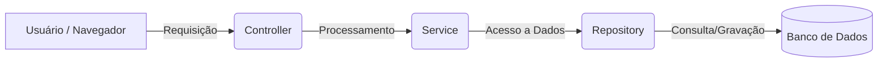

# 🏛️ Guia de Arquitetura: Funcionamento do Sistema

Este documento explica a organização e as decisões técnicas do projeto de forma simples e didática.

---

## 1. Organização em Camadas

O sistema é estruturado seguindo o padrão de camadas, onde cada parte tem uma responsabilidade bem definida:

1.  **Camada de Controle (Controller)**: Atua como a porta de entrada. Recebe as requisições (pedidos) do usuário, valida as informações básicas e direciona para o processamento. Ao final, entrega o resultado (JSON ou página HTML) de volta ao solicitante.
2.  **Camada de Serviço (Service)**: É o "cérebro" da aplicação. Contém as regras de negócio e os algoritmos (ex: cálculo de recorrência, filtros de data e montagem de escalações). Esta camada não se comunica diretamente com o usuário, focando apenas no processamento lógico.
3.  **Camada de Persistência (Repository)**: Responsável pelo acesso aos dados. Gerencia a leitura e gravação das informações no banco de dados.

### Fluxo da Informação:

---

## 2. Estrutura de Dados

As informações são organizadas em três tabelas principais que se relacionam entre si:

1.  **Integrante**: Cadastro dos participantes, contendo nome e função (ex: Atacante, Ala, Suporte).
2.  **Time**: Registro dos eventos semanais, vinculando um clube a uma data específica.
3.  **Composição do Time**: Tabela de ligação que associa integrantes aos seus respectivos times, permitindo que um jogador participe de diferentes escalações ao longo do tempo.

---

## 3. Lógica de Processamento

O sistema utiliza a **Stream API** do Java 17 para manipular as coleções de dados de forma eficiente. O processamento funciona como uma esteira de produção:

*   **Filtros**: O sistema isola apenas os dados que pertencem ao período solicitado.
*   **Mapeamento**: Os dados brutos são transformados em informações estatísticas.
*   **Agrupamento**: O sistema organiza as ocorrências para identificar padrões (como o time mais recorrente).

### Regra de Identidade do Time
Para identificar repetições, o sistema considera a união do **Nome do Clube + Lista de Integrantes**. 
> **Exemplo:** Se o "Chicago Bulls" utilizar os mesmos integrantes em duas datas diferentes, o sistema contabiliza como uma recorrência. Se os mesmos integrantes jogarem por outro clube, o sistema identifica como uma nova configuração de time.

---

## 4. Tecnologias Aplicadas

*   **Java 17 (Records)**: Utilizados para o transporte de dados (DTOs). Por serem imutáveis, garantem que a informação não seja alterada acidentalmente durante o processamento, aumentando a segurança do código.
*   **H2 Database (Banco em Memória)**: Perfil de execução que permite o funcionamento do sistema sem a necessidade de instalação de bancos de dados externos. Os dados são armazenados temporariamente na memória RAM.
*   **Swagger (OpenAPI)**: Interface interativa que documenta todos os pontos de acesso da aplicação, permitindo testes rápidos e visualização dos formatos de resposta.

---

## 5. Estratégia de Qualidade

A confiabilidade do sistema é garantida por diferentes níveis de testes automatizados:

1.  **Testes de Lógica**: Validam os algoritmos de cálculo e os filtros de período.
2.  **Testes de Robustez (Edge Cases)**: Garantem que o sistema continue operando corretamente mesmo quando informações opcionais (como datas) não são fornecidas.
3.  **Testes de Contrato**: Asseguram que a API entregue os dados exatamente no formato esperado pelo cliente.
4.  **Testes de Integridade**: Verificam a consistência da carga inicial de dados, prevenindo erros causados por informações duplicadas ou incompletas.

---

## 💡 Orientação para Desenvolvedores
Para entender a implementação dos algoritmos, o ponto de partida ideal é o arquivo `ApiService.java`. O código contém comentários técnicos que detalham o funcionamento de cada operação complexa.
